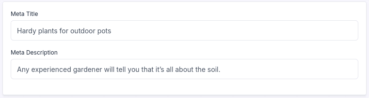

# UnoPIM CMS Custom

An example package to enrich [CMS page](https://github.com/magentix/unopim-cms) entity with new attributes.



# Installation

- Create `packages/Magentix/CmsCustom` directory

- Copy the repository files into this new directory (`packages/Magentix/CmsCustom/src/*`)

- Register the package in `composer.json`

```json
"autoload": {
    ...
    "psr-4": {
        // Other PSR-4 namespaces
        "Magentix\\CmsCustom\\": "packages/Magentix/CmsCustom/src"
    }
}
```

- Register the package's service provider in the `config/app.php` file

```php
<?php

return [
    
    // Other configuration options

    'providers' => ServiceProvider::defaultProviders()->merge([
        // Other service providers
        Magentix\CmsCustom\Providers\EventServiceProvider::class,
    ])->toArray(),
    
    // Other configuration options
];

```

- Run the commands to execute migrations and clear the cache

```bash
php artisan migrate
php artisan optimize:clear
```
